# Linux Privesc - Solutions

### sadeli.flag
First, ssh into the machine with the given \<IP>, \<PORT>, and \<PRIVATE KEY> with the syntax:
```
ssh sadeli@<IP> -p <PORT> -i <PRIVATE KEY>
```

The first flag, `sadeli.flag` is in sadeli's home directory.
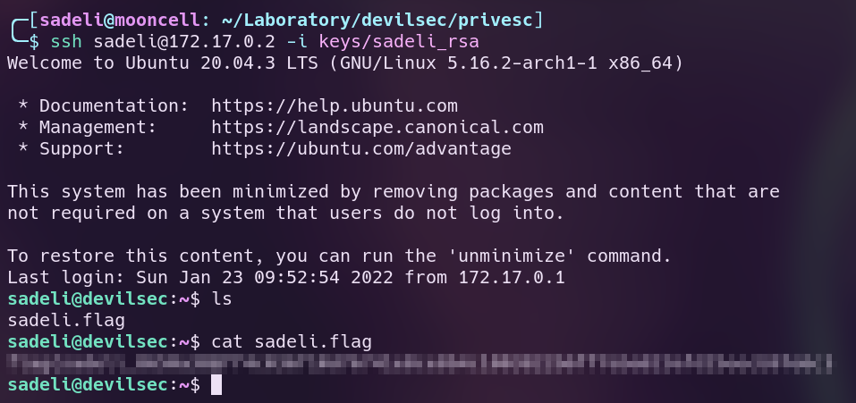

### 7StringsOvPasta.flag
There is a hidden file in sadeli's home directory, called `.backup.zip`. The owner of the file is 7StringsOvPasta and the user sadeli is unable to read it.
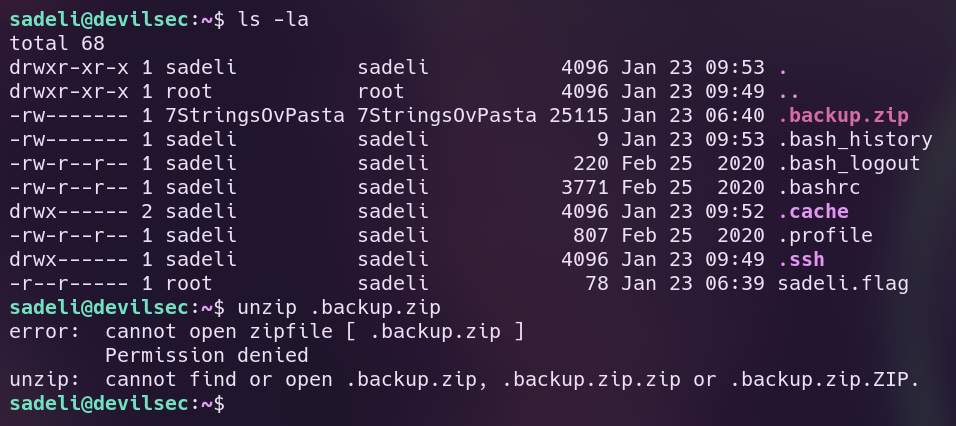

Running the command `sudo -l` lists the commands the user sadeli can run with sudo. The user sadeli can run the command `/usr/bin/vim` as the user 7StringsOvPasta.
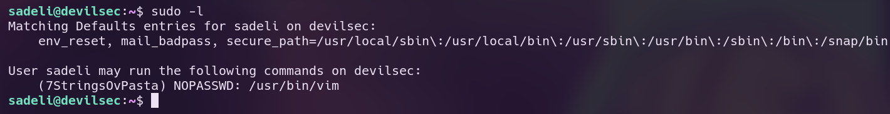

Using [gtfobins](https://gtfobins.github.io/gtfobins/vim/#sudo) as a reference, use vim to execute /bin/bash as 7StringsOvPasta.
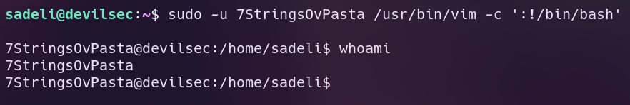

Copy `.backup.zip` to the `/tmp` directory and unzip it.
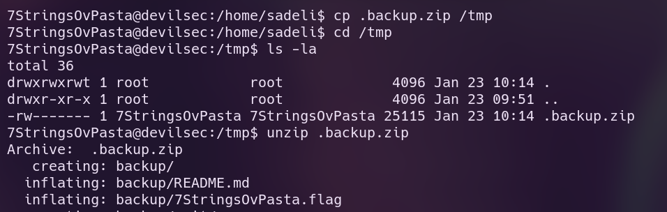

Enter the unzipped `backup/` directory. The second flag, `7StringsOvPasta` is located in the unzipped backup directory.
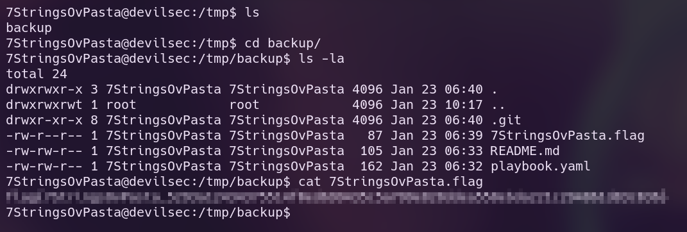

### tayari.flag
Inside of the `backup/` directory is another `.git/` directory, which indicates that this is a git repository. Running `git log` shows the history of commits made by the user `tayari <tayari@devilsec.org>`.
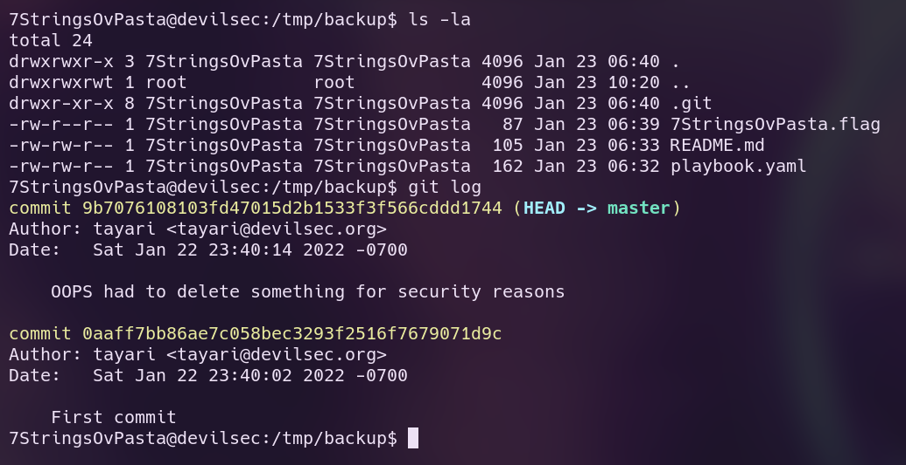

The current commit has a message which may indicate sensitive files in the previous commit:
> OOPS had to delete something for security reasons

Use `git diff` to compare the current commit with the previous commit.
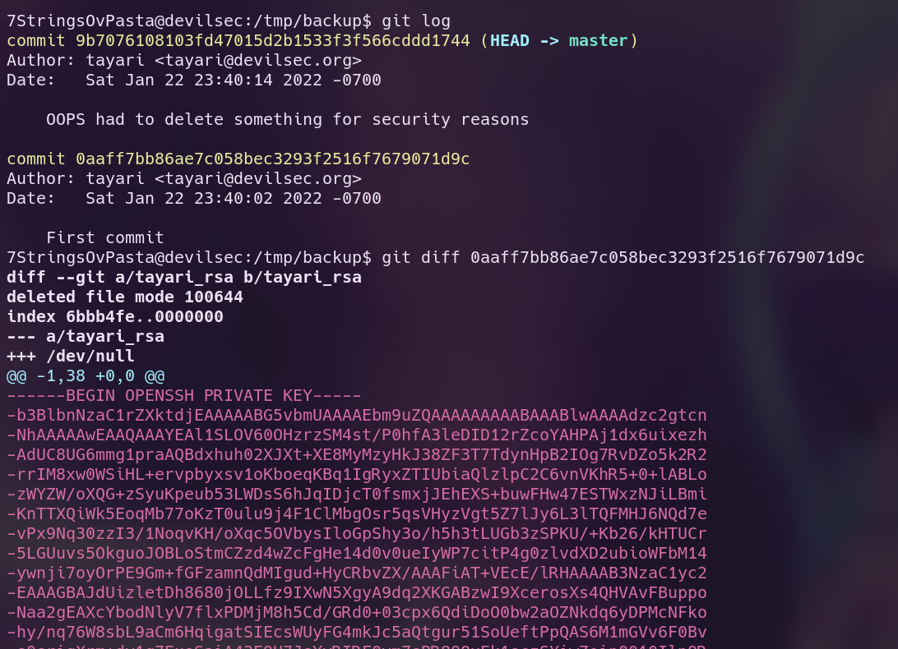

The previous commit shows that the private ssh key `tayari_rsa` was deleted. Recover it with `git checkout`.
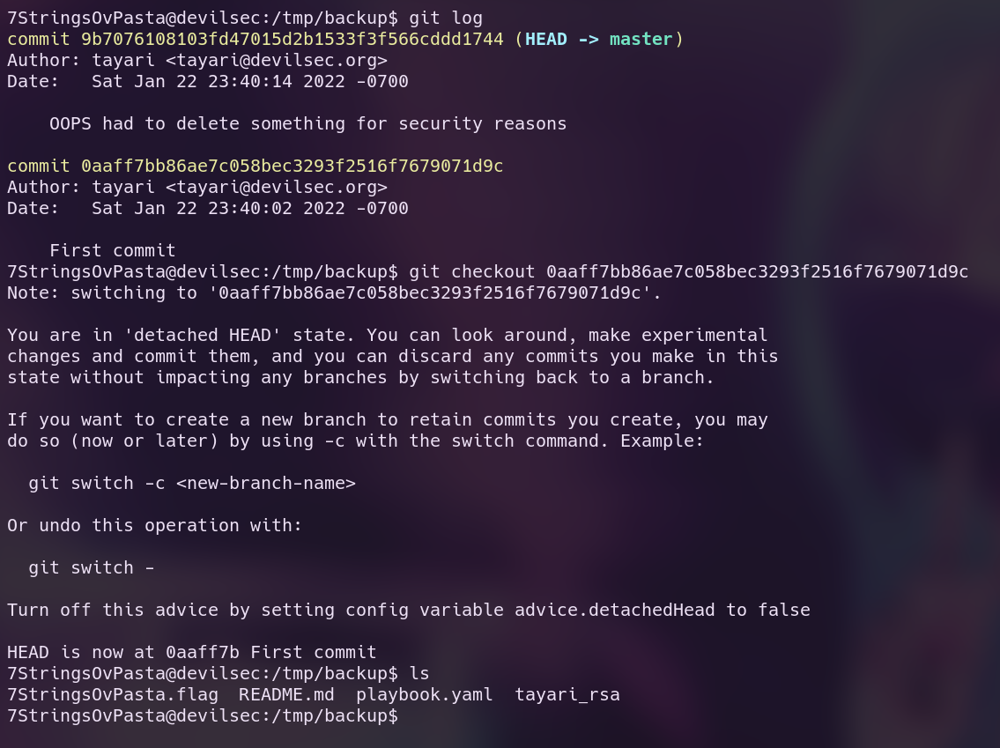

Use the tayari_rsa private key has bad permissions so it can't be used yet.
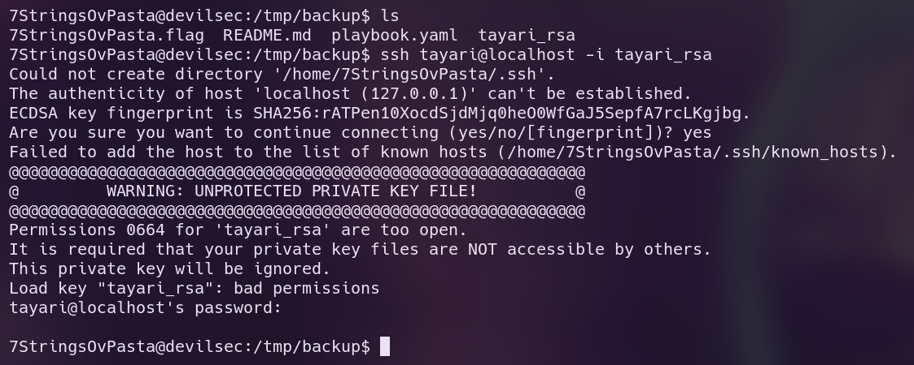

Run `chmod 600 tayari_rsa` to give the file proper permissions in order to use the private key.
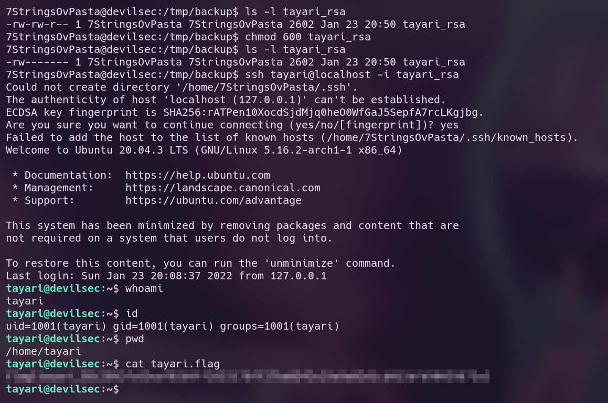

### root.flag
There are no obvious hints to the path to root in tayari's home directory. Using basic enumeration, running `ps faux` shows some interesting information about the running processes on the system.
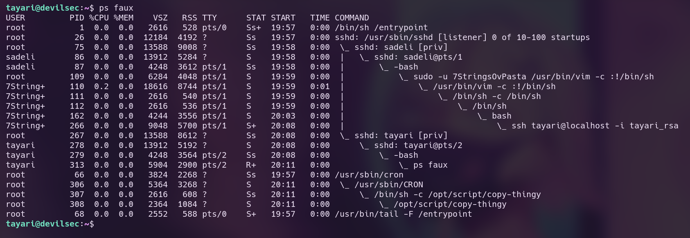

Processes:
- The first process, `/bin/sh/entrypoint` and the last process `/usr/bin/tail -F /entrypoint` seem related, but the user tayari has no permissions to read `/entrypoint`. So we'll come to that later.
- The second process is running sshd, but the process tree shows our own activity, so this doesn't seem like a valid path to privilege escalation yet. We'll come to that later.
- However towards the bottom, we can see the command `/opt/script/copy-thingy` is running inside of a CRON job as the user `root`. This looks interesting.

Visit `/opt/script/` and note that the directory is owned by root, but readable and writable to tayari.
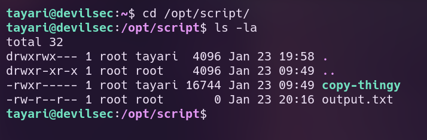

The file `copy-thingy` is the command running in a cron job, and the file `output.txt` is empty. `copy-thingy` is an ELF binary and not not a shell script so it can't be easily read. Decompiling the binary or simply running `strings` will give an idea on what the binary is.
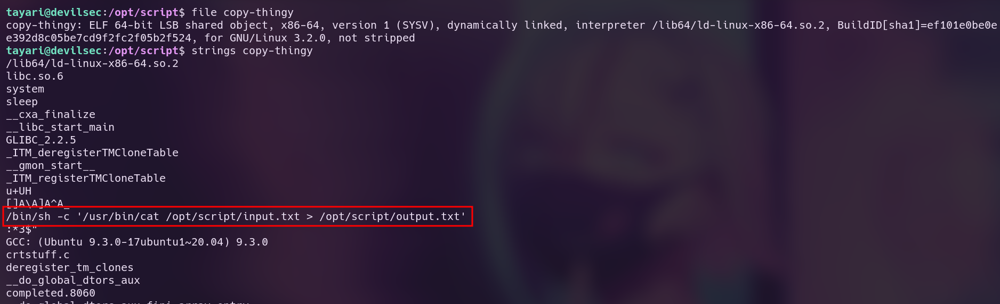

We see that the program `copy-thingy` is running a command:
> `/bin/sh -c '/usr/bin/cat /opt/script/input.txt > /opt/script/output.txt'`

This command is simply outputting the contents of `/opt/script/input.txt` and redirecting the output to overwrite `/opt/script/output.txt`. Because this is running as a cronjob root, this means we can read the file `/opt/script/input.txt` as root and write to the file `/opt/script/output.txt` as root.

Using symlinks, we may be able to read arbitrary files on the filesystem (by creating a symlink on `input.txt`) or even write to arbitrary files on the filesystem (by creating a symlink on `output.txt`). Either way actually works, but in this example I will create a symlink on `input.txt`.

Since we have write permissions in the `/opt/script` directory, create a file `/opt/script/input.txt`, and symlink it to `/root/.ssh/id_rsa`.
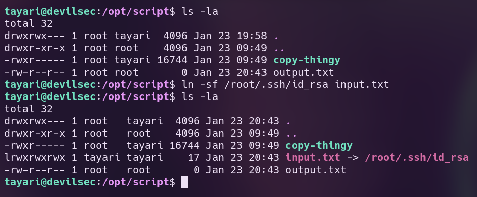

The next time the CRON job runs (which is actually once every minute), the file `output.txt` should contain the contents of `/root/.ssh/id_rsa`, the file `output.txt` should contain the contents of `/root/.ssh/id_rsa`.
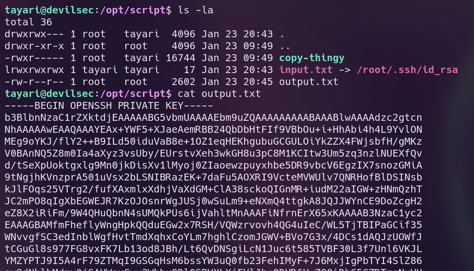

Since we can't change the permissions of `output.txt`, copy it to `/tmp/` and change the permissions there. Use the private key to ssh into the machine as root.
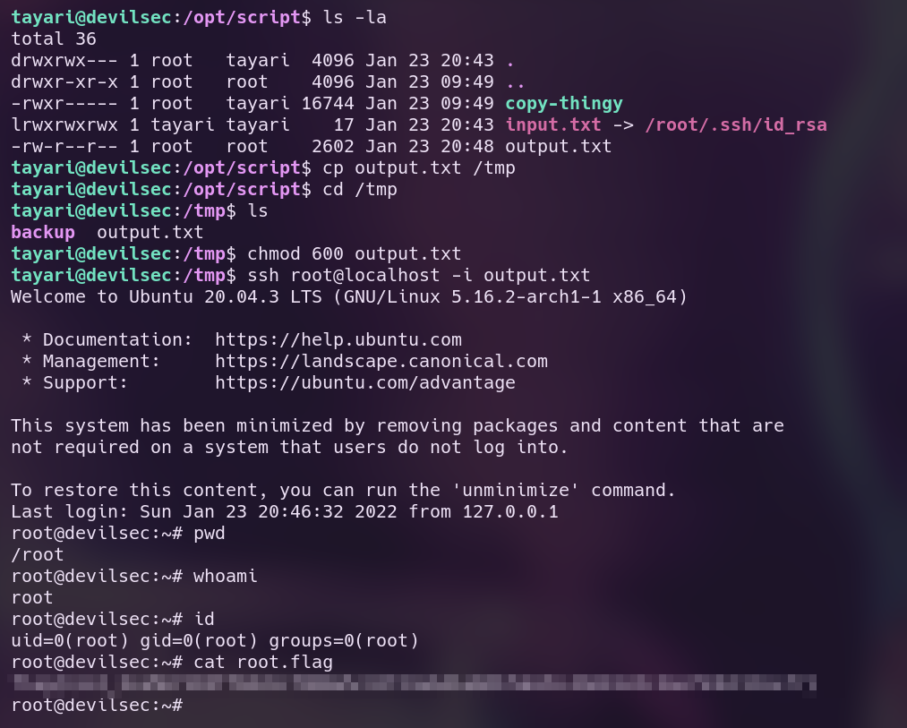

Alternatively, create a symlink on `output.txt` to overwrite `/root/.ssh/authorized_keys`, then copy `/home/tayari/.ssh/authorized_keys` to `input.txt`:
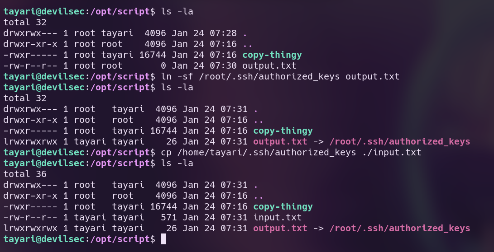

Now that the root user's authorized keys have been overwritten, login as root using tayari's ssh key (which is the same in `/tmp/backup/id_rsa`).
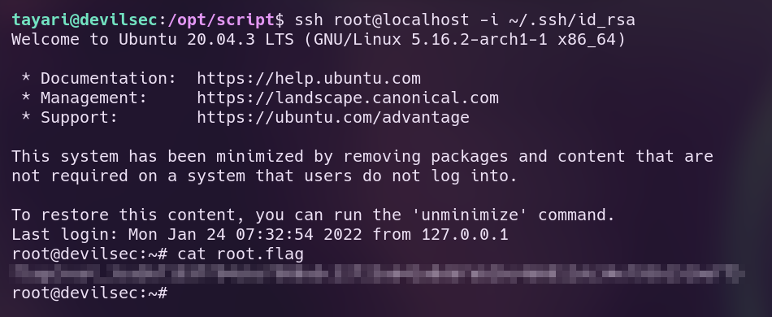
